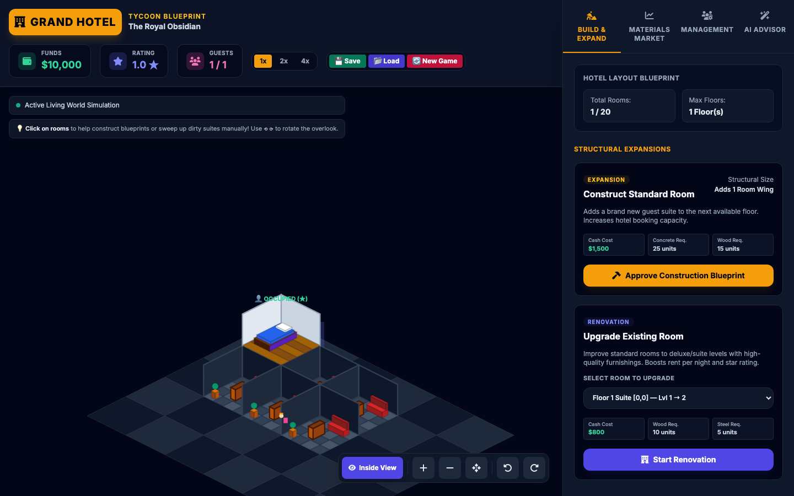
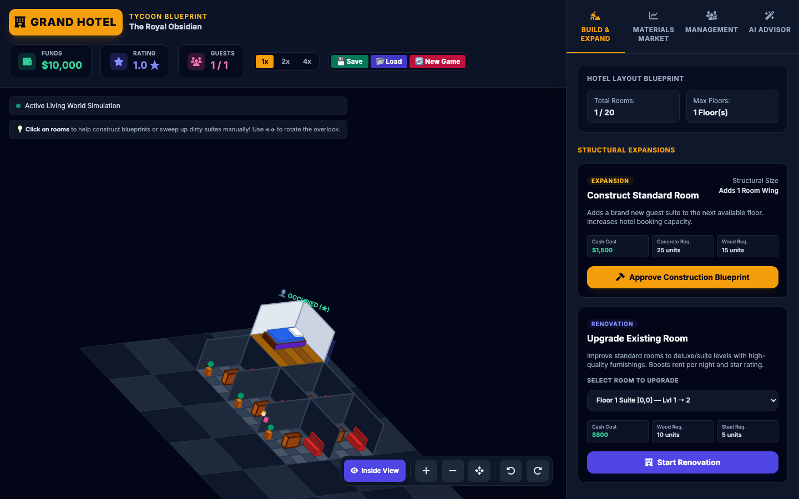
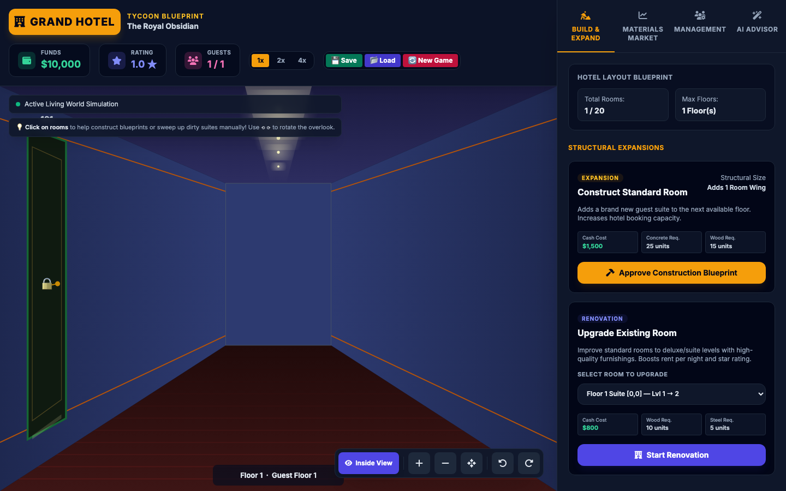

# Grand Hotel Blueprint

**Run a hotel** in the browser — an isometric hotel tycoon where you buy materials, build and upgrade suites, hire staff, and keep guests flowing while balancing payroll and construction.

<p align="center">
  
</p>

<p align="center"><em>Isometric overlook — build floors, track cash and materials in the HUD.</em></p>

---

## Screenshots

<table>
  <tr>
    <td align="center" width="33%">
      
      <br /><sub><b>Default view</b> — pan, zoom, and build from the blueprint panel.</sub>
    </td>
    <td align="center" width="33%">
      
      <br /><sub><b>Rotated overlook</b> — ⟲ ⟳ controls help reach rooms when floors stack.</sub>
    </td>
    <td align="center" width="33%">
      
      <br /><sub><b>First-person</b> — walk the corridor and step into rooms (WebGL interiors).</sub>
    </td>
  </tr>
</table>

---

## Features

| Area | What you get |
|------|----------------|
| **Economy** | Cash, dynamic material market, room rent by tier, **one-time staff hire fees** (no hourly payroll), and game speed (1×–4×). |
| **Building** | Guest rooms from blueprint through construction to ready / occupied / dirty lifecycle. |
| **Staff** | Housekeepers, builders, receptionists — hire, fire, and balance runway. |
| **Views** | Inside / exterior isometric modes, optional **yaw rotation** for stacked floors, **first-person** corridor + room interiors. |
| **Persistence** | Save / load including camera (pan, zoom, rotation). |
| **AI agent** | Optional Playwright + LLM player with JSONL logs for balance tuning (see below). |

---

## Quick start

**Option A — open the file (simplest)**  
Double-click `grand_hotel_blueprint.html` or open it from your editor’s live preview.  
If anything fails to load (some environments block `file://` CDNs), use Option B.

**Option B — local HTTP server (recommended)**

```bash
cd /path/to/run-a-hotel
python3 -m http.server 8765
```

Then visit **http://localhost:8765/grand_hotel_blueprint.html**

---

## Controls (high level)

- **Build / upgrade / hire** — left panel tabs (Build, Management, Materials, …).
- **Canvas** — click rooms to nudge construction or help clean dirty suites.
- **View toolbar** — zoom (wheel; **Shift+wheel** = **orbit** instead of zoom in Inside/Exterior), reset view, **rotate** (⟲ ⟳ or **right-drag / Alt+drag** on canvas for smooth **360°**), cycle **Inside → Exterior → 1st Person → Manager walk**. Walkers show **STAFF/GUEST** tags. **Proprietor** in lobby + header; rename under **Management → Proprietor**.
- **Save / Load / New game** — header buttons; new games use the current starting budget (see `CHANGELOG.md`).

Full mechanics and balance notes live in **`CHANGELOG.md`**.

---

## Repository layout

| Path | Purpose |
|------|---------|
| `grand_hotel_blueprint.html` | Main entry — layout, Tailwind shell, script tags. |
| `js/game-state.js` | `state`, hotel grid, iso math, save/load. |
| `js/renderer.js` | Canvas isometric drawing, input, first-person canvas. |
| `js/ui.js` | DOM wiring, toasts, simulation step, `window.startNewGame`, etc. |
| `ai-agent/` | Playwright bot + `README.md` (how it reads `window.state` via `page.evaluate`). |
| `docs/screenshots/` | Images used by this README (regenerate anytime). |

---

## AI agent (autoplay & balance research)

The **`ai-agent/`** package drives the same page in Chromium, snapshots **`window.state`**, asks Claude or OpenAI for one JSON action per tick, and clicks through the real UI. Logs go to **`ai-agent/logs/*.jsonl`**.

```bash
cd ai-agent
npm install
npx playwright install chromium   # once
ANTHROPIC_API_KEY=sk-ant-... npm start
```

See **`ai-agent/README.md`** for flags (`--headless`, `--turns`, `--continue-save`, model choice).

---

## Regenerating README screenshots

Requires **`ai-agent`** dependencies (Playwright writes into `docs/screenshots/`):

```bash
cd ai-agent
node capture-readme-screenshots.mjs
```

Commit the updated PNGs if the UI changed significantly.

---

## Tech stack

- **Vanilla JS** modules — no bundler required for the game itself.  
- **Canvas 2D** — isometric hotel and 2D first-person corridor.  
- **Three.js** (CDN) — 3D room interior when you enter a suite.  
- **Tailwind CSS** + **Font Awesome** (CDNs).

---

## License

No `LICENSE` file is present in this repository yet; treat usage as **all rights reserved** until one is added.
